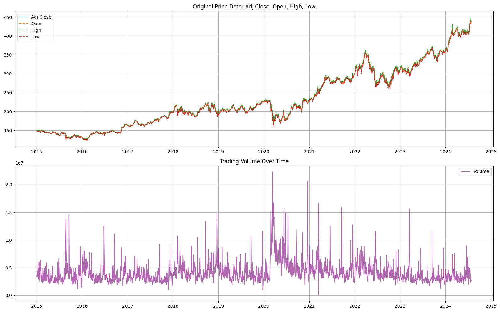
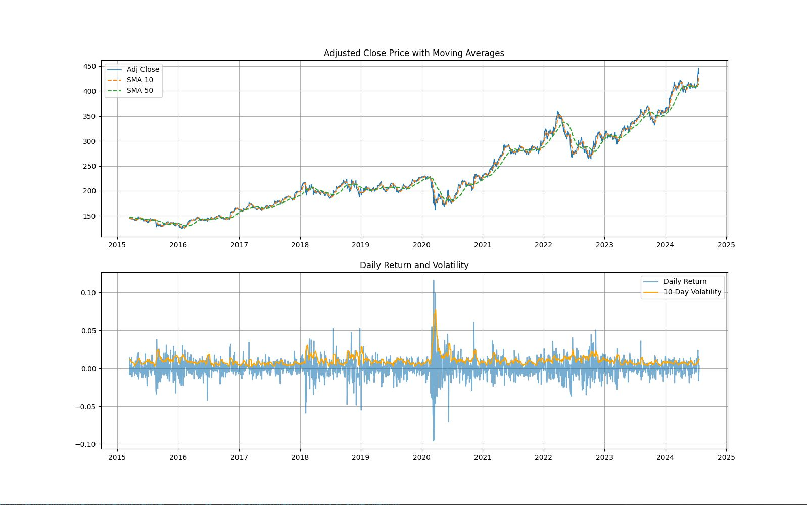

# CS 325 ML Project Notes

## Motivation

### Problem:
The main problem we aim to solve is predicting movements in the market by using
historical data. By using trends in the data to help predict how a stock might move
would help reduce the risk of investing.

### Goal:
Our goal is to process the historical data of stock prices and apply machine learning
algorithms to predict future prices. This would provide insights into the market which
would allow traders to optimize their strategies and improve risk management.

### Target Audience:
The audience is targeted towards individual investors, but can also be used by analysts
and algorithmic traders who want data-driven insights to optimize their trades and
reduce risk

### Prior Attempts (in the industry):
Traditional indicators: Using moving averages, RSI, and MACD do not effectively capture
nonlinear relationships between data.

### Baseline Models:
ARIMA, Linear Regression, Random forest

### Needs for Project:
- Python
- Pandas
- Numpy
- Scikit-Learn

## Milestones
- [x] Finalize Motivation (2/21/25)
- [x] Review Dataset & Understand Structure (2/24/25)
- [x] Data Preprocessing: Clean and Prepare Data (2/28/25)
- [x] Visualize Trends & Correlations (3/7/25)
- [ ] Model Selection: Implement baselines (3/22/25)
- [ ] Model Training and Optimizations (3/29/25)
- [ ] **Submit Midterm Project Report (04/04/25)**
- [ ] Adjustments and Finalize ML (4/18/25)
- [ ] **SUBMIT PROJECT PRESENTATION (04/25/25)**
- [ ] **SUBMIT PROJECT REPORT (05/02/25)**

## Current Progress
We started out by reviewing the dataset as a team and finding an angle on what how we wanted to attack our main problem. We created a graph to visualize all the data to get a better understanding.

We then started to preprocess the data. There were a few requirements for this. We knew we didn't necessarily need the date as this would cause the data to be time-reliant. In addition to this we decided that there were a few unncessary datapoints such as:
- Open
- High
- Low

The goal of dropping these columns where to reduce the following issues:
- Redundency:
    - Since Close or Adj Close fit more consistently for our idea of the model.
- Noise: 
    - These three columns can cause volatility and introduce randomness that would not be beneficial to our goal of predicting longer-term values.
- Simplicity:
    - To try and counteract overfitting, we wanted to simplifty our data to only what we need.

After finishing our preprocessing and cleaning, we moved onto visualizing trends. With data it can be difficult to understand what you are looking at without graphing it out, we used matplotlib to visualize our preprocessed data to get a clearer picture.

## Next Steps:
We stopped at Model Selection. The idea we had is to create an ensemble model mixing together ARIMA, Random Forest, and Linear Regression. The reasoning behind this was to use each model's pros and mitigate the cons. 
- Linear Regression:
    - Pro: Good for testing relevance
    - Con: Assumes linear relationships
    - Con: Struggles with volatility and complex trends
- Random Forest Regressor
    - Pro: Handles nonlinearity & interactions well
    - Pro: Robust to noise and overfitting with tuning
    - Con: Would not be time-aware
- ARIMA
    - Pro: Best for time series
    - Pro: Captures trends
    - Con: Built for time series
    - Con: Struggles with nonlinear patterns

By using an ensemble we can combine the benefits from each model and create a ML algorithm that can learn from both price history and engineered signals. We thought about training each independent model then using a weighted average system we can control the accuracy and fine-tune our model.

# Important Dates
**Next Milestone:** Model Selection + Model Training (03/29/2025)

**NEXT SUBMISSION DATE:** Midterm Project Report **04/04/2025**